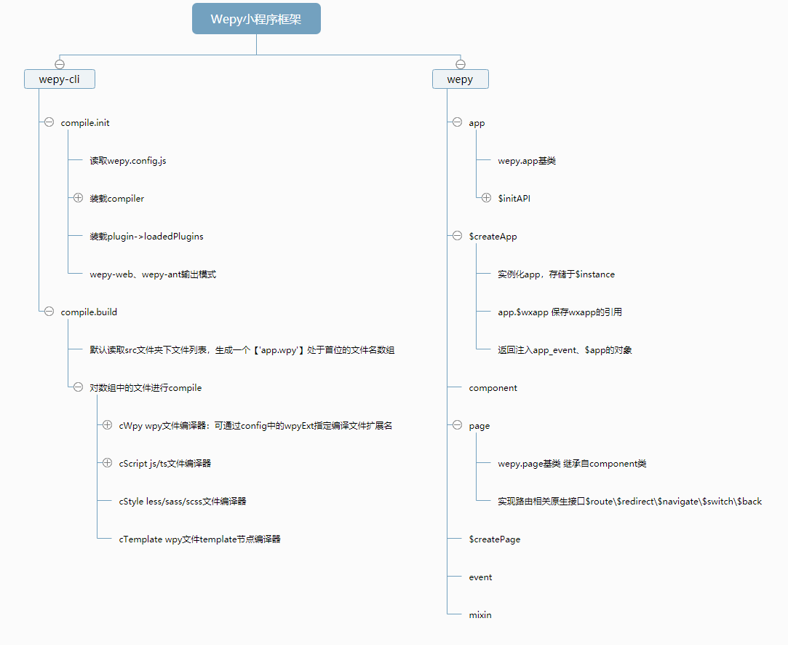

Wepy 小程序框架源码浅析
=====

最近，各种小程序出现，市场好不热闹。
鉴于之前对小程序原生框架有一次浅显的尝试(仅限于官方API接口、组件文档阅读)，并做了一个小工具而已。
小程序开发方面也有了Wepy、MPVue等开源框架的出现。于是，出于对小程序的兴趣，也尝试对Wepy框架源码进行一次学习。

## wepy-cli
wepy-cli 即wepy 命令行工具，包含了init \ buidl \ upgrade等指令工具。
主要介绍一下 wepy build 指令。
因为build指令中，主要完成了对于wepy框架中很重要的一项功能：从wpy文件到js/wxml/json/wxss文件的解析。实现了类Vue.js的开发模式。

### compile.init
编译初始阶段：框架通过wepy.config.js配置信息，完成loader\plugin的加载，指定编译目标目录。
- loader: 如果使用过webpack的朋友，可以将loader理解为webpack中的loader，其作用就是为了对wpy文件解析出来的js/template/style; 目前wepy已有wepy-compiler-babel/wepy-compiler-sass/wepy-compiler-less等
- plugin: 作用于资源文件，对资源（图片、字体）进行压缩、代码混淆等处理。

### compile.build
编辑构建阶段：从app.wpy文件作为小程序入口文件，生成wpy结构对象
- 读取wpy.style对象中code进行编译，保存为wxss文件
- 读取wpy.template对象中code进行编译，保存为wxml文件
- 读取wpy.script对象中code进行编译，保存为js文件
- 在编译script时，page、app分别以require('wepy').default.$createPage()、require('wepy').default.$createApp()方式输出

至此，wepy完成对于小程序项目的构建编译。

## wepy
wepy 即wepy框架的核心对象，包含了app、page、component、event、mixin和$createApp\$createPage方法。完成了对wx 对象的接口封装等一系列操作。
